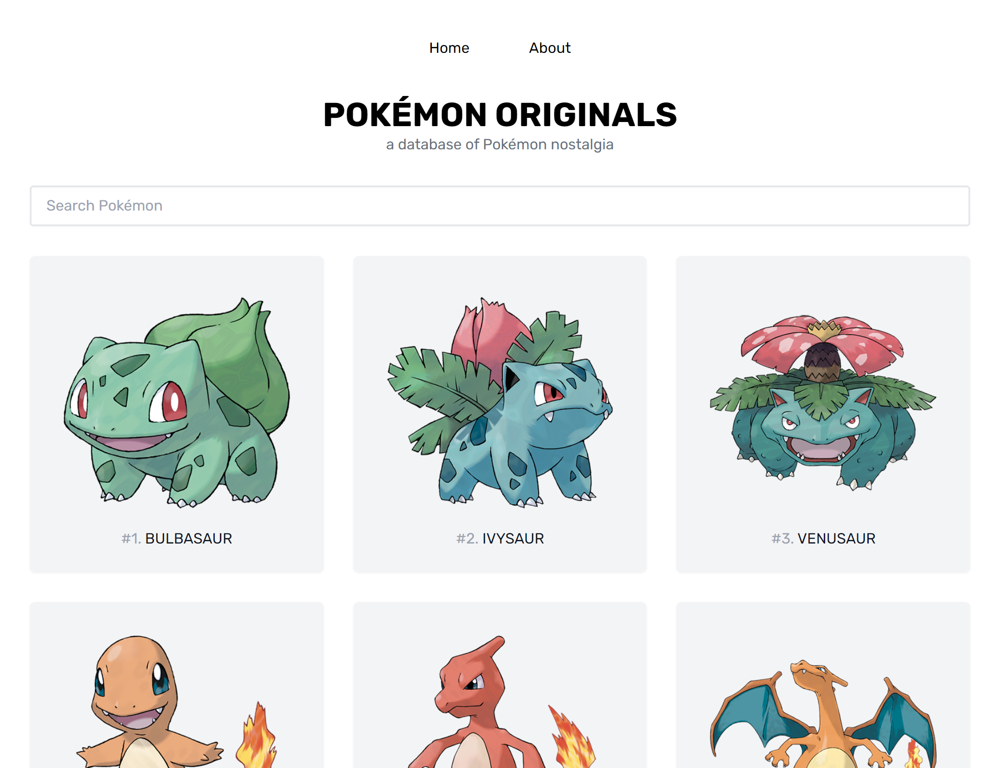

# Pokemon Originals

## Table of contents

- [Overview](#overview)
  - [Description](#description)
  - [Screenshot](#screenshot)
  - [Links](#links)
- [My process](#my-process)
  - [Built with](#built-with)
  - [What I learned](#what-i-learned)
  - [Continued development](#continued-development)
- [Author](#author)
- [Acknowledgments](#acknowledgments)

## Overview

### Description

Pokemon Originals is a database of pokemon nostalgia! It contains all the 151 original Pokemon, letting the user filter, search, and read the details of each Pokemon.
It's based on the [SvelteKit Crash Course Tutorial](https://www.youtube.com/watch?v=UU7MgYIbtAk) from James Q. Quick.

### Screenshot



### Links

- [Live Site](https://pokemon-originals.vercel.app/)

## My process

### Built with

- [SvelteKit](https://kit.svelte.dev/) - Svelte framework
- [TailwindCSS](https://tailwindcss.com/) - For styling
- [PokeAPI](https://pokeapi.co/) - API for Pokemon info and stats

### What I learned

This was a great project to get my feet wet with Svelte. Compared to React, I learned that Svelte is a more lightweight framework, close to vanilla Javascript. The syntax, albeit different, is conceptually similar to React. I also felt very comfortable on the development environment.

I learned how to build Svelte components, and how to filter the Pokemon in the UI, dynamically updating it.

```svelte
import PokeCard from '../components/PokeCard.svelte';
	export let pokemon;
	let searchTerm = '';
	let filteredPokemon = [];

	$: {
		if (searchTerm) {
			filteredPokemon = pokemon.filter((poke) =>
				poke.name.toLowerCase().includes(searchTerm.toLowerCase())
			);
		} else {
			filteredPokemon = [...pokemon];
		}
	}
```

```svelte
<input
	type="text"
	class="w-full border-2 py-2 px-4 rounded"
	placeholder="Search Pokémon"
	bind:value={searchTerm}
/>
<div class="grid gap-8 grid-cols-1 md:grid-cols-2 lg:grid-cols-3">
	{#each filteredPokemon as poke}
		<PokeCard {poke} />
	{/each}
</div>
```

This was also a great opportunity to improve my ability to work with API's, as I fetched all the Pokemon data from PokeAPI. I also managed to incorporate dynamic images for each Pokemon, from [Serebii.net](https://www.serebii.net/)

### Continued development

I did not manage to complete the Pokemon details page. Although I managed to fetch the correct data from the API, I struggled to build the UI from it. In the future I plan to complete this part of the project.

## Author

- Github - [Gonçalo Dias](https://github.com/goncalodiasmm)
- Twitter - [@goncalodiasmm](https://twitter.com/goncalodiasmm)

## Acknowledgments

The [SvelteKit Crash Course Tutorial](https://www.youtube.com/watch?v=UU7MgYIbtAk) from James Q. Quick helped me immensely to understand the Svelte development paradigm, and broaden my knowledge on Javascript frameworks.
